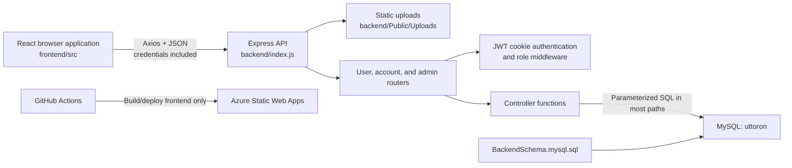
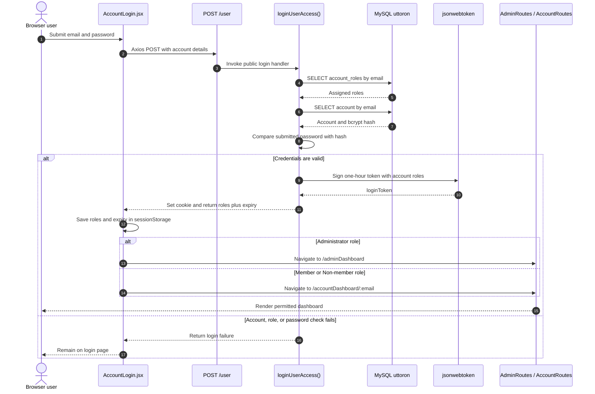
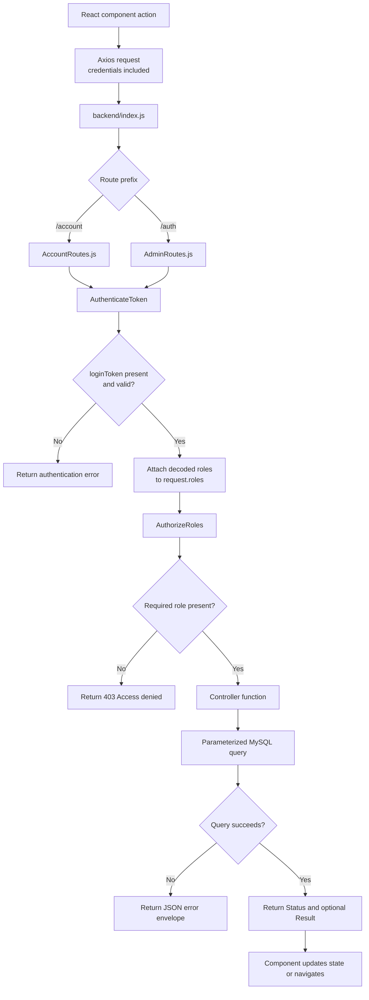

# Design Document: New Contributor Onboarding

**Status:** Current-state onboarding baseline  
**Last reviewed:** 2026-09-04  
**Audience:** Contributors making frontend, backend, or database changes

## 1. Purpose

This document gives a new contributor one reliable path from cloning the repository
to understanding, running, changing, and validating the full-stack application. It
describes the repository as it exists today, including incomplete features and
tooling gaps. It is not a target-state architecture proposal.

The onboarding experience should enable a contributor to:

1. Identify which layer owns a change and which adjacent layers it affects.
2. Run the MySQL database, Express API, and React application locally.
3. Exercise anonymous, account, and administrator paths.
4. Follow the project's existing implementation patterns without copying known
   defects.
5. Submit a small change with an explicit validation record.

## 2. Current-State Summary

The project is a three-tier membership and event-management application:

| Layer | Current technology | Primary location | Runtime |
|---|---|---|---|
| Browser client | React 18, React Router 7, Vite 6, Axios, Bootstrap, MUI | `frontend/` | `http://localhost:5173` |
| HTTP API | Node.js ES modules, Express 4, callback-based MySQL access | `backend/` | `http://localhost:3000` |
| Persistence | MySQL/InnoDB schema and seed data | `datastore/Schema/BackendSchema.mysql.sql` | Local MySQL |
| Deployment | Azure Static Web Apps workflow for the frontend | `.github/workflows/azure-static-web-apps-ashy-meadow-03076d30f.yml` | Push or PR against `main` |

There is no root package manifest, workspace manager, container definition, test
suite, migration runner, or pinned Node.js version. The frontend and backend are
installed and run as independent npm projects. Package lock files are currently
ignored.

## 3. Architecture



### 3.1 Frontend

`frontend/src/main.jsx` mounts `App` under React `StrictMode`.
`frontend/src/App.jsx` owns the browser route tree:

- Public routes cover login, account creation, public event pages, public content
  pages, and shopping placeholders.
- `/accountDashboard/:account_email` is wrapped by `AccountRoutes` and contains
  account-home and member-registration views.
- `/adminDashboard` is wrapped by `AdminRoutes` and contains administration for
  accounts, members, lookup values, events, pages, and member products.

Most components own their local form state and call the API directly with Axios.
Some newer code uses `frontend/src/Utilities/Locations.js`, while older components
embed `http://localhost:3000`. There is no shared API client, query-key convention,
or centralized error boundary yet.

Frontend route guards read roles and expiry from `sessionStorage`. These guards are
only a navigation convenience; authorization is enforced again by backend
middleware on protected API routes.

### 3.2 Backend

`backend/index.js` creates one Express server and mounts three routers:

| Prefix | Router | Intended access |
|---|---|---|
| `/user` | `backend/Routes/UserRoutes.js` | Anonymous account login/creation and public event/page reads |
| `/account` | `backend/Routes/AccountRoutes.js` | Authenticated administrator, member, or non-member access |
| `/auth` | `backend/Routes/AdminRoutes.js` | Administrator-only management operations, except logout |

The request path is:

```text
Express middleware
  -> route declaration
  -> token authentication when required
  -> role authorization when required
  -> controller function
  -> shared MySQL connection
  -> JSON response
```

Controllers in `backend/Controllers/` contain both application logic and SQL.
There is no separate service or repository layer. New changes should remain
consistent with this layout unless the change explicitly introduces and applies a
new shared abstraction.

### 3.3 Authentication and authorization

Login is implemented in `backend/Controllers/UserAccess.js`:

1. Account roles are loaded by email.
2. The account record is loaded by email.
3. The submitted password is compared with the bcrypt hash.
4. A one-hour JWT is written to the `loginToken` cookie.
5. Role names and token expiry are returned to the frontend.

Protected routes run `TokenValidation.js` and then
`RoleAuthorization.js`. Roles are string constants duplicated in
`backend/Configurations/Roles.js` and
`frontend/src/Configurations/Roles.js`:

- `Administrator`
- `Member`
- `Non-member`
- `Volunteer`

The JWT signing configuration is repository-sensitive. Contributors must never put
real credentials or production signing material in commits, examples, screenshots,
issues, or logs.

### 3.4 Database

The schema script targets a database named `uttoron`. It creates and seeds:

| Area | Tables |
|---|---|
| Identity and membership | `accounts`, `account_roles`, `role_types`, `members`, `age_groups`, `membership_categories`, `membership_prices` |
| Content | `events`, `pages` |
| Commerce scaffolding | `product_types`, `member_products`, `non_member_products` |

Important relationships include:

- An account has one or more roles through `account_roles`.
- Members belong to an account, age group, and membership category.
- Membership prices reference membership categories.
- Member products reference an event, product type, and target membership
  category.
- Non-member products reference an event and product type.
- Deleting an event cascades to its member and non-member products.

The SQL file is an idempotent bootstrap script only in part: tables and seed rows
use `IF NOT EXISTS` or `INSERT IGNORE`, but unconditional `ALTER TABLE` statements
can fail when the script is rerun against an already initialized database. Treat
it as an initial schema, not a migration system.

### 3.5 Code flow diagrams

#### Login and role-based navigation

This sequence shows how the public login screen establishes both the backend
authentication cookie and the frontend navigation session:



The cookie is the backend's authentication credential. The `sessionStorage`
record supports frontend navigation only and must not be treated as proof of
authorization.

#### Protected API request

All protected account and administrator operations follow this decision flow:



#### Public content request

Public event and page views bypass authentication but use the same controller and
database pattern:

```mermaid
flowchart LR
    BrowserRoute["/events/:event_url<br/>or /pages/:page_url"] --> Component["ViewEvent.jsx<br/>or ViewPage.jsx"]
    Component --> Helper["ServerLocation()"]
    Helper --> PublicAPI["GET /user/events/:event_url<br/>or /user/pages/:page_url"]
    PublicAPI --> UserRouter["UserRoutes.js"]
    UserRouter --> PublicController["viewEventUserAccess()<br/>or viewPageUserAccess()"]
    PublicController --> Lookup["SELECT by URL placeholder"]
    Lookup --> Database[("MySQL")]
    Database --> Envelope["{ Status, Result?, Error? }"]
    Envelope --> Render["Render content and uploaded images"]
```



## 4. Repository Map

```text
showcase/
|-- .github/workflows/       Frontend Azure Static Web Apps workflow
|-- backend/
|   |-- Configurations/      Shared backend role and signing configuration
|   |-- Controllers/         Request handlers and SQL
|   |-- Middlewares/         JWT authentication and role authorization
|   |-- Routes/              Express endpoint declarations
|   |-- Utilities/           MySQL connection and file upload configuration
|   |-- index.js             API composition and port/CORS configuration
|   `-- package.json         Backend dependencies and start command
|-- datastore/
|   `-- Schema/              MySQL bootstrap schema and seed values
|-- frontend/
|   |-- css/                 Global and CSS-module styles
|   |-- public/Images/       Checked-in static images
|   |-- src/
|   |   |-- Components/
|   |   |   |-- AccountAccess/
|   |   |   |-- AdminAccess/
|   |   |   |-- QuillEditor/
|   |   |   |-- RouteManagement/
|   |   |   `-- UserAccess/
|   |   |-- Configurations/  Frontend role constants
|   |   |-- Utilities/       URL, upload, format, and notification helpers
|   |   |-- App.jsx          Browser routes
|   |   `-- main.jsx         React entry point
|   |-- eslint.config.js
|   |-- vite.config.js
|   `-- package.json
`-- README.md                Existing local setup walkthrough
```

## 5. Local Development Contract

### 5.1 Prerequisites

- Git
- Node.js and npm. The repository does not pin a version; use a supported Node.js
  LTS release and record the version in bug reports.
- MySQL 8.x. The schema uses MySQL-specific syntax and the
  `utf8mb4_0900_ai_ci` collation.
- A MySQL client capable of running the schema script.
- Two terminals, plus access to MySQL.

Express is a project dependency and does not need a global installation.

### 5.2 Database initialization

1. Create an empty MySQL database named `uttoron`.
2. Run `datastore/Schema/BackendSchema.mysql.sql`.
3. Confirm that the seed rows exist in `role_types`, `age_groups`,
   `membership_categories`, and `membership_prices`.
4. Configure the backend connection for the local instance.

The root README currently refers to a database named `showcase`, while the schema
and backend source target `uttoron`. For the current code, use `uttoron`.

The current connection and signing configuration are source files rather than a
complete environment-variable contract. Use local-only credentials, do not commit
credential changes, and inspect the staged diff before every commit. Moving all
runtime configuration to ignored environment variables is a prerequisite for a
safe shared setup.

### 5.3 Install and start

From the repository root:

```powershell
Set-Location backend
npm install
npm start
```

The backend uses `nodemon` and listens on port `3000`. A healthy startup prints
that the server is running and that the database connection succeeded.

In a second terminal:

```powershell
Set-Location frontend
npm install
npm run dev
```

Open `http://localhost:5173`. The backend CORS policy currently permits that exact
origin.

Because package lock files are ignored, installs are not reproducible across time.
Do not assume that a fresh dependency resolution matches another contributor's
machine.

### 5.4 Establish administrator access

There is no administrator bootstrap command or UI. To exercise administrator
features:

1. Create an account through the UI.
2. Insert an `Administrator` row for that email in `account_roles`.
3. Log out and log in again so the new role is included in the JWT.

Use only disposable local data. Never copy production account data into a local
database.

## 6. First-Run Smoke Test

Complete this sequence before changing code:

| Step | Expected result |
|---|---|
| Open `/` | Login form renders |
| Create an account | Password is stored as a bcrypt hash and the account receives `Non-member` |
| Log in | Browser receives the auth cookie and navigates to the account dashboard |
| Register a member | Member appears on the account dashboard |
| Grant `Administrator` in local SQL and log in again | Admin dashboard renders |
| Open role, age-group, category, and price lists | Seed data loads |
| Create and view an event | Event persists and its public URL renders |
| Create and view a page | Page persists and its public URL renders |
| Log out | Auth cookie and frontend login session are cleared |

Record failures before making a change. Several UI controls are placeholders, so a
disabled or unlinked action is not automatically a local setup failure.

## 7. How to Make a Change

### 7.1 Frontend-only change

1. Locate the route in `frontend/src/App.jsx`.
2. Locate its component under the matching access area.
3. Reuse existing CSS modules or shared CSS before adding another styling system.
4. Use `ServerLocation()` for API and upload URLs instead of adding another
   hard-coded backend origin.
5. Preserve credentialed Axios requests for authenticated operations.
6. Run `npm run lint` and `npm run build` from `frontend/`.

### 7.2 Backend endpoint change

1. Choose the router based on access level: public user, authenticated account, or
   administrator.
2. Add or change the controller export in the corresponding controller file.
3. Use parameter placeholders for every external value in SQL.
4. Apply `AuthenticateToken` and `AuthorizeRoles` to protected routes.
5. Keep the established JSON envelope while touching existing callers:
   `{ Status, Result?, Error? }`.
6. Update every frontend caller in the same change.
7. Manually exercise success, validation, unauthenticated, unauthorized, missing
   record, and database-error paths.

### 7.3 Database change

There is no migration framework. A schema change therefore has a larger review
surface:

1. Update the bootstrap schema.
2. Provide a separately reviewable migration statement in the pull request
   description for existing developer databases.
3. Update all controller reads and writes.
4. Update frontend field names and rendering.
5. Test both a clean database bootstrap and an upgrade of an existing local
   database.
6. State rollback steps explicitly.

### 7.4 Cross-stack feature

Trace the complete contract before editing:

```mermaid
flowchart LR
    Route["1. React route"] --> State["2. Component state<br/>and payload"]
    State --> Client["3. Axios URL<br/>and HTTP method"]
    Client --> ApiRoute["4. Express route"]
    ApiRoute --> Access["5. Authentication<br/>and authorization"]
    Access --> Handler["6. Controller fields<br/>and validation"]
    Handler --> Schema["7. SQL columns<br/>and constraints"]
    Schema --> Envelope["8. Response envelope"]
    Envelope --> Rendering["9. Component response<br/>and rendering"]
```



Field naming is currently mixed: frontend payloads are generally camelCase,
database columns are snake_case, and API responses often expose database rows
directly. Document the translation at the controller boundary for every new or
changed field.

## 8. Existing Conventions

Follow these conventions for changes that remain within the current architecture:

- Use ECMAScript modules (`import`/`export`) in both npm projects.
- Use PascalCase for React component filenames and camelCase for functions and
  local values.
- Group frontend components by access area.
- Group backend endpoints into router and controller files by access area.
- Use plural database table names and snake_case columns.
- Use parameterized MySQL queries for request-derived values.
- Return after sending an Express response.
- Keep role values synchronized between frontend constants, backend constants,
  and seeded database values.
- Avoid introducing another URL-building pattern; converge on
  `frontend/src/Utilities/Locations.js`.

The repository has mixed quote style, indentation, semicolon usage, and direct
state mutation. New code should satisfy the existing frontend ESLint configuration
and prefer immutable React state updates. Do not reformat unrelated files.

## 9. Validation and Pull Request Expectations

### 9.1 Available automated checks

| Area | Command | Current meaning |
|---|---|---|
| Frontend lint | `npm run lint` | ESLint rules for JS/JSX and React hooks |
| Frontend build | `npm run build` | Vite production bundle |
| Backend tests | `npm test` | Placeholder that intentionally exits with failure |
| Backend lint/build | None | No configured command |
| Database validation | None | Manual schema and smoke testing |

For every pull request, list the commands and manual paths actually exercised.
Do not claim backend automated test coverage until a test runner and tests exist.

### 9.2 Minimum review evidence

- Scope and affected layers.
- Screenshots for visible UI changes.
- Request and response examples for API changes, with tokens and personal data
  removed.
- Schema upgrade and rollback notes for database changes.
- Authentication and role scenarios exercised.
- Known limitations that remain after the change.

## 10. Known Gaps and Contributor Guardrails

These are verified characteristics of the current repository, not tasks that every
new contributor should fix opportunistically:

| Area | Current gap | Contributor guardrail |
|---|---|---|
| Secrets and database configuration | Runtime credentials and signing configuration are source-based | Never commit real secrets; prefer an explicit environment configuration change |
| Database naming | README says `showcase`; schema and code use `uttoron` | Use `uttoron` until configuration is centralized |
| Dependency reproducibility | Both projects ignore package lock files | Record versions when diagnosing install regressions |
| Backend quality gates | No backend tests, lint, or build script | Use focused manual API checks and keep changes small |
| Frontend API configuration | Most calls hard-code localhost; some use `ServerLocation()` | Route new calls through the utility |
| Frontend route guards | Guards assume `loginSession` exists and parse it directly | Exercise direct navigation with an empty and expired session |
| Account/member deletion | Frontend invokes delete endpoints not declared by the backend router | Do not treat those buttons as supported until both sides are implemented |
| Page updates | The page `PUT` route is wired to the event update handler | Avoid extending page edit behavior without correcting and testing the route |
| Multi-write operations | Account/member creation and product replacement are not transactional | Treat partial writes as a known data-consistency risk |
| Uploads | Files are written to local disk without documented size/type policy | Use disposable files locally; add limits before production use |
| CI deployment | Workflow deploys only `frontend/` and names `build` as output, while Vite defaults to `dist` | Verify workflow configuration before relying on deployment success |
| API version variables | Version environment variables are read but not used in route mounting | Do not assume API versioning exists |
| Incomplete UI | Shopping, account actions, and some page actions are placeholders | Confirm a backend route exists before implementing against a button |

Fixing one of these gaps should be a focused pull request with explicit behavior
before and after. Avoid mixing broad cleanup with a feature change.

## 11. Recommended First Contribution

The first contribution should be small, observable, and limited to one vertical
slice. Good candidates include:

- Consolidating a small set of related Axios calls behind `ServerLocation()`.
- Adding a missing frontend empty, loading, or error state.
- Correcting one frontend/backend route mismatch with manual contract checks.
- Adding focused backend tests while introducing a test runner in a dedicated
  tooling change.
- Documenting and implementing an environment variable for one runtime setting
  without exposing its value.

Avoid using authentication, schema redesign, multi-step writes, or upload security
as a first contribution unless paired with an experienced reviewer.

## 12. Onboarding Journey Design

The contributor journey is intentionally staged:

| Stage | Contributor outcome | Evidence |
|---|---|---|
| 1. Orient | Can identify the owning layer and access boundary | Repository map and architecture trace |
| 2. Bootstrap | Can start all three tiers without committing local configuration | Successful database and server startup |
| 3. Observe | Can complete the smoke test and separate known gaps from regressions | Recorded baseline results |
| 4. Change | Can trace one vertical contract and make a scoped edit | Focused diff |
| 5. Validate | Can run available checks and exercise missing automated coverage manually | PR validation notes |
| 6. Review | Can explain data, auth, and deployment impact | Review-ready PR description |

### Success criteria

This onboarding design is successful when a new contributor can:

- reach the login page and connect the API to a local database without private
  assistance;
- explain the route-to-controller-to-table flow for their change;
- identify whether a route is public, account-scoped, or administrator-only;
- avoid committing credentials and generated files;
- run the available frontend checks;
- disclose the absence of backend automation instead of assuming it exists; and
- submit a first pull request that changes one coherent vertical slice.

## 13. Design Decisions

### Document current state before proposing a target architecture

- **Decision:** Teach the system that exists and label debt explicitly.
- **Rationale:** A newcomer must be productive before safely refactoring.
- **Alternative considered:** Describe a service/repository architecture as if it
  already existed.
- **Rejected because:** It would send contributors searching for abstractions that
  are not present and encourage inconsistent partial migrations.
- **Ripple cost:** The document requires periodic review as known gaps are fixed.

### Use a vertical-slice mental model

- **Decision:** Teach contributors to trace browser route through database column.
- **Rationale:** Frontend payload names, API contracts, and schema fields are
  tightly coupled.
- **Alternative considered:** Separate frontend and backend onboarding tracks.
- **Rejected because:** It would hide contract and authorization mismatches.
- **Ripple cost:** Even a one-layer change requires checking adjacent contracts.

### Treat manual validation as explicit evidence

- **Decision:** Document manual scenarios while automated backend coverage is
  absent.
- **Rationale:** Pretending a quality gate exists is riskier than making the gap
  visible.
- **Alternative considered:** Require a new test framework before any contribution.
- **Rejected because:** That would block unrelated small fixes and is a separate
  architecture decision.
- **Ripple cost:** Pull request descriptions must carry more validation detail
  until automation is added.

## 14. Maintenance

Update this document in the same pull request when any of these change:

- ports, origins, environment variables, or startup commands;
- package manager or supported Node/MySQL versions;
- route prefixes, role semantics, or authentication flow;
- schema bootstrap or migration strategy;
- test, lint, build, or deployment commands;
- repository layout; or
- any known gap listed above.

The contributor who changes a contract owns the corresponding onboarding update.
